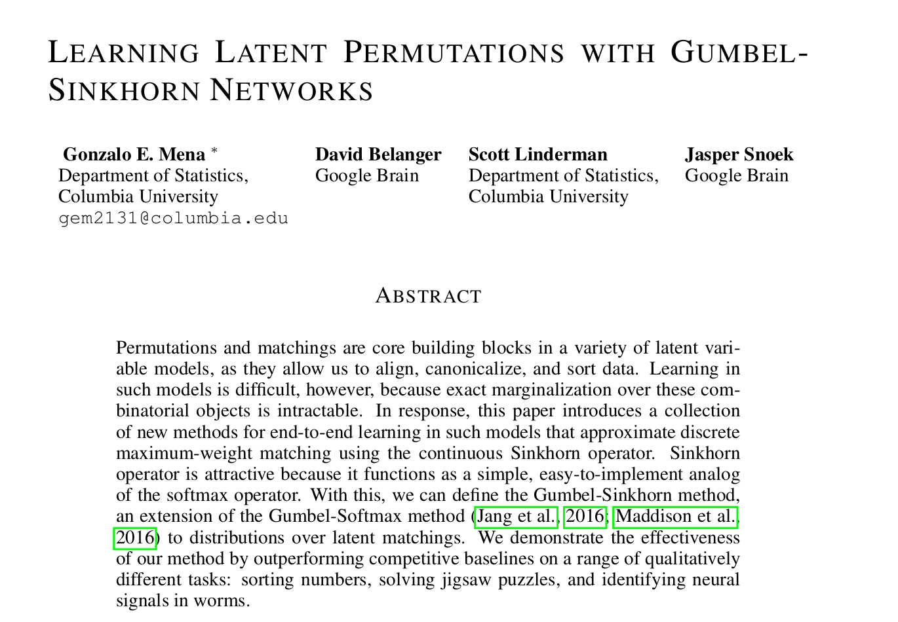

# Neural-Sorting-Algorithms-Gumbel-Sinkhorn-Networks
We train a neural network in Python to sort lists of numbers using the Gumbel-Sinkhorn architecture from the original 2018 paper.

This is the unofficial [LeetArxiv](https://leetarxiv.substack.com/p/gumbel-sinkhorn-neural-sort) implementation of the paper *Learning Latent Permutations with Gumbel-Sinkhorn Networks* that introduces *Gumbel-Sinkhorn networks*: neural networks that learn to sort items by differentiation.

The complete writeup is available [here.](https://leetarxiv.substack.com/p/gumbel-sinkhorn-neural-sort)

Gumbel-Sinkhorn networks build on the fact that permutations can be represented by matrices. 
The authors are further inspired by:
1. The [reparametarization trick](https://leetarxiv.substack.com/p/stable-diffusion-from-scratch-1?utm_source=publication-search) from diffusion models.
2. The [1967 Sinkhorn matrix](https://leetarxiv.substack.com/p/sinkhorn-knopp-algorithm-24d?utm_source=publication-search) balancing algorithm.
3. [Belief propagation](https://leetarxiv.substack.com/p/sinkhorn-solves-sudoku?utm_source=publication-search) an obscure alternative to backprop that uses Sinkhorn balancing to solve Sudoku.

## Getting Started
Either download the provided `Jupyter Notebook` or run on [Google Colab](https://colab.research.google.com/drive/1_386oAXNeaWwhixim8iOuaiutsSeGyxe?usp=sharing).

